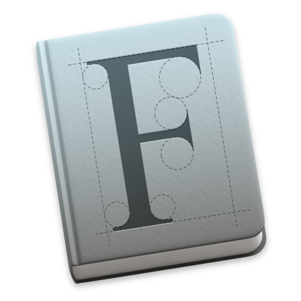
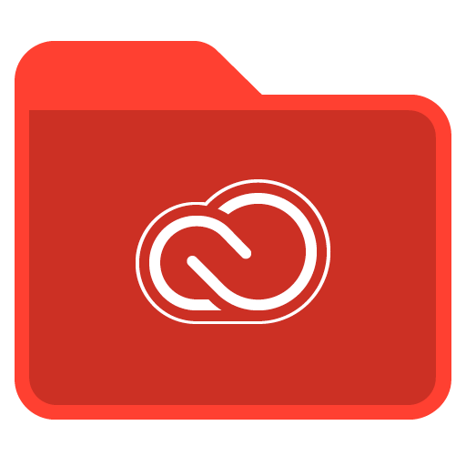

# Maylis Agniel’s dotfiles
**This is my local configuration for working on web stuff on a Mac.**

## Prerequisites
- [**Brew**](https://brew.sh)
- [**Prezto**](https://github.com/sorin-ionescu/prezto)

## Commands
List all available Make recipes
```
make
```

## Software configuration



The mono typeface I use for both Sublime Text and iTerm is [**Roboto Mono**](https://fonts.google.com/specimen/Roboto+Mono).


Install [**Package Control**](https://packagecontrol.io/installation)


#### Appearance > General
- Theme: Dark (High Contrast)
- Tab bar location: Top
- Status bar location: Bottom

#### Appearance > Windows
Uncheck all

#### Appearance > Dimming
- ☑️ Dim inactive split panes
- ☑️ Dimming affects only text, not background.

#### Profiles > Default > General
Working Directory: Reuse previous session’s directory

#### Profiles > Default > Text
Font: Roboto Mono, Regular, 18

#### Profiles > Default > Window
Settings for New Windows: Columns: 120, Rows: 36

#### Profiles > Default > Session
☑️ Status bar enabled

#### Profiles > Default > Session > Status bar enabled > Configure Status Bar > Advanced…
- Set all Colors to `000000`
- Font: Roboto Mono, Regular, 14
- ☑️ Prefer tight packing to stable positioning

#### Profiles > Default > Session > Status bar enabled > Configure Status Bar
1. Drag and drop desired Components in Active Components dropzone
2. Activate 🌈 Auto-Rainbow


1. Disable HTTP Cache when toolbox is open
2. Set Firefox as default browser
3. Set Desktop as destination folder in *Downloads*


1. Disable Chrome cache while DevTools is open
2. Set Desktop as destination folder in *Downloads*


1. Install [**Runner**](https://sketchrunner.com) plugin
2. Install the following plugins using Runner:
  - [**Find and Replace**](https://github.com/thierryc/Sketch-Find-And-Replace)
  - [**Fontily**](https://github.com/partyka1/Fontily)
  - [**Replace Colour**](https://github.com/lewishowles/sketch-replace-colour)
  - [**Style Inventory**](https://github.com/getflourish/Sketch-Style-Inventory)
  - [**Symbol Organizer**](https://github.com/sonburn/symbol-organizer)
  - [**Unused Style Remover**](https://github.com/sonburn/unused-style-remover)



1. Install these apps:
  - **Photoshop**
  - **Illustrator**
  - **InDesign**
  - **Acrobat**
2. Install Photoshop [**GuideGuide**](https://guideguide.me/documentation/) extension
3. Install [Photoshop additional scripts](adobe-creative-cloud/photoshop)
4. Install [InDesign additional scripts](adobe-creative-cloud/indesign)


Set a [mail signature](https://github.com/wearemd/wearemd_mail_signatures) for each account

Yay, you're done! 👏 👏
